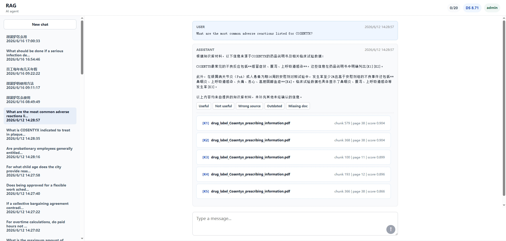
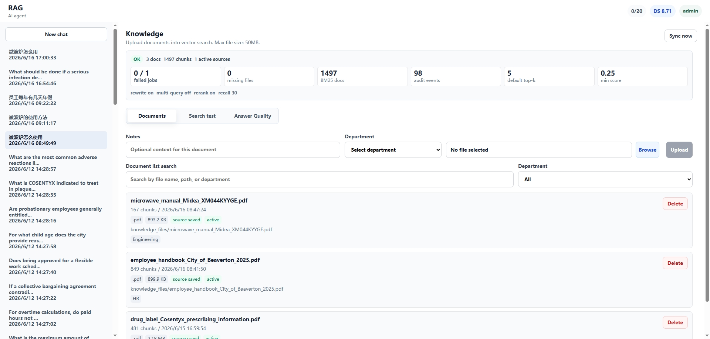
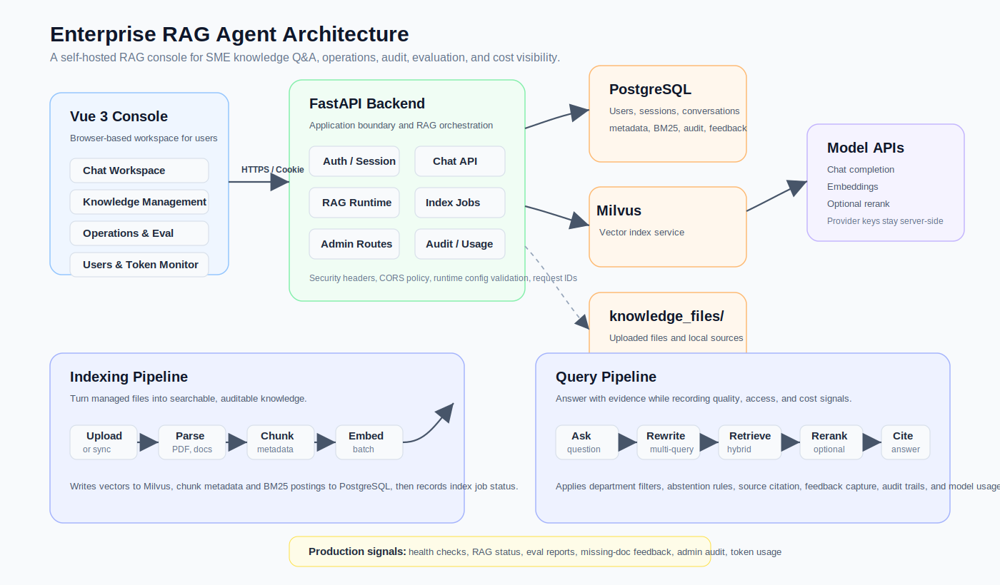

# RAG Agent

面向中小企业部署场景的 RAG 助手与运维控制台。

项目目标是提供一套可开源展示、可本地开发、可单机部署、可逐步扩展到企业内部知识问答的基础工程。


## 快速导航

- 快速开始：从 `环境变量` 到 `启动应用`，适合首次跑通项目
- 生产部署：查看 `docs/deployment.md`
- 架构说明：查看 `docs/architecture.md`
- 生产检查：查看 `docs/PRODUCTION_READINESS_CHECKLIST.md`

## 项目亮点

| 模块 | 能力 | 适合场景 |
| --- | --- | --- |
| 聊天与会话 | 登录保护、会话历史、流式响应 | 内部知识问答、AI 助手入口 |
| 知识库管理 | 上传文档、本地知识源同步、索引任务 | 文档沉淀、批量导入、知识更新 |
| 检索链路 | 向量检索、BM25、混合召回、可选重排 | 提升召回质量与答案稳定性 |
| 安全与审计 | 会话认证、管理员审计、知识访问审计 | 企业内部可控部署 |
| 运维与评测 | RAG 状态、评测报告、token 监控 | 持续优化效果和成本 |

## 界面预览

以下截图展示聊天工作台、知识库管理和系统架构，覆盖用户问答、知识维护与 RAG 生产链路。

### 控制台总览



### 知识库管理



## 架构概览



## 核心能力

- 基于 FastAPI 的后端，提供登录保护的聊天、会话和运维接口。
- 基于 Vue 3 的前端控制台，覆盖聊天、知识库管理、用户管理、运维面板和 token 监控。
- 使用 PostgreSQL 存储用户、会话、知识库元数据、审计事件、反馈和模型调用量等结构化数据。
- 使用 Chroma 做向量持久化，并结合 PostgreSQL 的 chunk 元数据与 BM25 做混合检索。
- 支持知识上传、本地知识源同步、索引任务、访问控制、RAG 评测和审计。

## 适用场景

- 中小企业内部知识问答与检索增强。
- 需要可控部署边界和可审计后台的 AI 助手。
- 个人作品集中的完整全栈 RAG 项目展示。

## 为什么适合中小企业

- 部署路径清晰：支持本地开发、单机生产和逐步扩展，不要求一开始就引入复杂基础设施。
- 成本相对可控：默认强调混合检索、可配置重排和 token 监控，便于平衡效果与预算。
- 安全边界明确：后端密钥、会话 Cookie、CORS 和静态资源暴露边界都有默认建议。
- 运维入口完整：内置健康检查、RAG 状态、评测接口和审计能力，便于上线后持续维护。

## 技术栈

- 后端：FastAPI
- 前端：Vue 3 + Vite
- 关系型数据：PostgreSQL
- 向量存储：Chroma
- 检索策略：向量检索 + BM25 + 可选重排

## 项目结构

```text
backend/          FastAPI 应用、路由、服务、RAG 链路、数据库辅助代码、测试
frontend/         Vue 3 浏览器端应用
scripts/          RAG 评测与维护脚本
docs/             部署、架构与生产检查文档
rag_eval/         评测题目与生成的报告
knowledge_files/  本地知识源文件目录，已被 Git 忽略
chroma_db/        本地 Chroma 持久化目录，已被 Git 忽略
compose.yml       开发环境使用的本地 PostgreSQL 服务
compose.prod.yml  服务器部署使用的 PostgreSQL、后端与 nginx 服务
run_tests.py      后端 unittest 测试入口
```

## 最小可运行架构

```text
Browser
  -> Vue 3 frontend
    -> FastAPI backend
      -> PostgreSQL
      -> Chroma
      -> Model APIs
      -> knowledge_files/
```

## 快速开始

### 1. 准备环境变量

复制示例文件并填写真实值：

```powershell
Copy-Item .env.example .env
Copy-Item frontend\.env.example frontend\.env
```

至少需要补充这些后端变量：

- `DEEPSEEK_API_KEY`
- `EMBEDDING_API_KEY`
- `POSTGRES_PASSWORD`
- `DATABASE_URL`
- `TEST_DATABASE_URL`
- `APP_USERNAME`
- `APP_PASSWORD`

前端本地开发默认使用：

```env
VITE_API_BASE=http://localhost:8000
```

### 2. 启动本地 PostgreSQL

```powershell
docker compose up -d
```

本地开发推荐方式是：

- 应用代码运行在主机上，便于调试
- Docker 只运行 PostgreSQL
- 后端通过 `localhost:5432` 连接数据库

### 3. 安装依赖

后端：

```powershell
python -m venv .venv
.\.venv\Scripts\python.exe -m pip install -r backend\requirements.txt
```

前端：

```powershell
cd frontend
npm.cmd install --cache .npm-cache
```

### 4. 启动应用

后端：

```powershell
cd backend
..\.venv\Scripts\python.exe -m uvicorn main:app --reload --host 127.0.0.1 --port 8000
```

前端：

```powershell
cd frontend
npm.cmd run dev
```

访问地址：

- 前端：`http://localhost:5173`
- 健康检查：`http://localhost:8000/health`

## 测试

后端快速测试：

```powershell
.\.venv\Scripts\python.exe run_tests.py --group fast
```

依赖数据库的测试组需要串行运行：

```powershell
.\.venv\Scripts\python.exe run_tests.py --group database
.\.venv\Scripts\python.exe run_tests.py --group vector
.\.venv\Scripts\python.exe run_tests.py --group api
```

前端：

```powershell
cd frontend
npm.cmd test
npm.cmd run build
```

## CI/CD 与镜像发布

项目使用 GitHub Actions 作为主 CI。默认流程会在 `main` 分支 push 和 pull request 时运行：

- 后端 unittest
- 前端测试
- 前端构建
- 后端 Docker 镜像构建

当代码 push 到 `main` 且上述步骤全部通过后，CI 会将后端镜像推送到腾讯云 TCR 个人版镜像仓库：

```text
ccr.ccs.tencentyun.com/enterprise-rag-agent/enterprise-rag-agent:latest
ccr.ccs.tencentyun.com/enterprise-rag-agent/enterprise-rag-agent:<git-sha>
```

启用镜像推送需要在 GitHub 仓库的 `Settings -> Secrets and variables -> Actions` 中配置：

```text
TCR_USERNAME=你的腾讯云账号 ID
TCR_PASSWORD=腾讯云 TCR 个人版初始化密码
```

这些密钥只存放在 GitHub Secrets 中，不应写入仓库文件。未配置这些 Secrets 时，普通 clone、本地开发和手动部署不受影响；fork 项目后如需发布到自己的镜像仓库，请调整 `.github/workflows/ci.yml` 中的镜像仓库地址和对应 Secrets。

## 生产部署概览

- 使用 `docker compose --env-file .env.prod -f compose.prod.yml up -d` 启动生产栈。
- 部署前先构建前端产物 `frontend/dist/`。
- 生产环境使用项目根目录的 `.env.prod` 注入后端与数据库变量。
- 建议通过 HTTPS 和同源部署方式提供前后端服务。
- 生产环境应设置 `APP_ENV=production`、`SESSION_COOKIE_SECURE=true`、`CORS_ALLOW_LOCALHOST_REGEX=false`。
- 只公开静态前端产物，不要暴露 `.env`、`backend/`、`knowledge_files/`、`chroma_db/`、`logs/` 或数据库目录。

## 文档导航

- 部署说明：`docs/deployment.md`
- 架构说明：`docs/architecture.md`
- 生产就绪检查：`docs/PRODUCTION_READINESS_CHECKLIST.md`
- 资源规范：`docs/assets/README.md`

## 安全提示

- 不要把真实 API key、数据库密码或管理员密码提交到 Git。
- 不要把任何后端密钥放进前端 `VITE_` 变量。
- 测试数据库必须和业务数据库分开，避免测试误删真实数据。

## 许可证

本仓库使用 `MIT License`。
